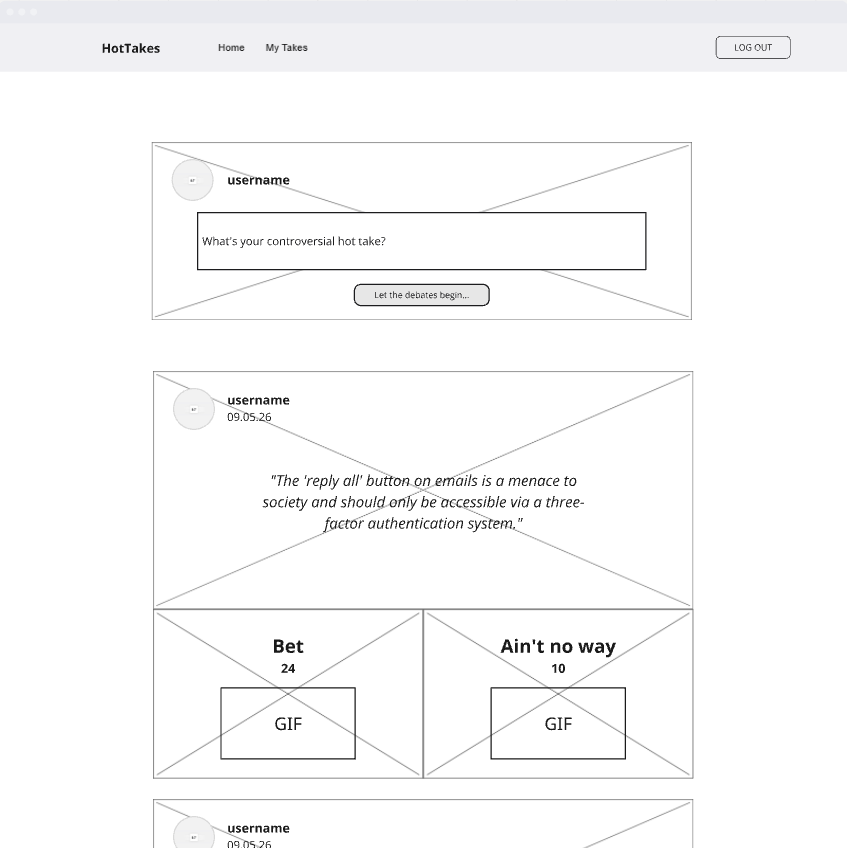
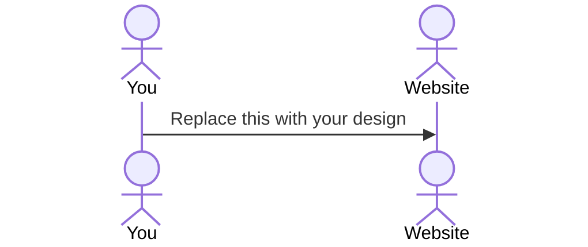

# HotTakes

[My Notes](notes.md)

"Hot Takes" is a social polling application designed for sharing and reacting to controversial opinions with straightforward, punchy engagement. Users can effortlessly post their own provocative statements, which are then presented to the community for a quick verdict. Each hot take features two distinct interaction buttons: "Bet" for agreement and "Ain't no way" for disagreement, dynamically enhanced with a random, sentiment-appropriate GIF to visually amplify the user's choice. Vote counts update in real-time, offering instant feedback on the community's collective stance, making "Hot Takes" an efficient and entertaining platform for lively, opinion-driven interaction

## 🚀 Specification Deliverable

For this deliverable I did the following. I checked the box `[x]` and added a description for things I completed.

- [x] Proper use of Markdown
- [x] A concise and compelling elevator pitch
- [x] Description of key features
- [x] Description of how you will use each technology
- [x] One or more rough sketches of your application. Images must be embedded in this file using Markdown image references.

### Elevator pitch

"Hot Takes is the super-fast way to settle debates! Post your most controversial opinions, then see them immediately voted on by the community with simple 'Bet' or 'Ain't no way' buttons. It's quick, visually engaging, and gets straight to the point – just pure, unfiltered opinion battles. Ready to see if your hot take is a hit or a miss?"

### Design

Lorem ipsum dolor sit amet, consectetur adipiscing elit, sed do eiusmod tempor incididunt ut labore et dolore magna aliqua. Ut enim ad minim veniam, quis nostrud exercitation ullamco laboris nisi ut aliquip ex ea commodo consequat. Duis aute irure dolor in reprehenderit in voluptate velit esse cillum dolore eu fugiat nulla pariatur. Excepteur sint occaecat cupidatat non proident, sunt in culpa qui officia deserunt mollit anim id est laborum.

### Key features

- Hot Take Submission: Users can easily submit their own controversial opinions via a dedicated input area on the home page.
- Opinion Polling: Each hot take features two clear interaction buttons—"Bet" (to agree) and "Ain't no way" (to disagree)—for users to cast their vote.
- Real-time Vote Counts: Numerical tallies for both "Bet" and "Ain't no way" are displayed immediately, showing the current community sentiment.
- User Identification: Every hot take is attributed to a specific username and includes a timestamp to indicate when it was posted.
- Personal "My Takes" Feed: A dedicated section allows users to view and track all the hot takes they have personally submitted.
- User Authentication: A 'Log Out' option signifies a user account system for personalized and secure access to the application.

### Technologies

I am going to use the required technologies in the following ways.

- **HTML** - Structures the application with two main pages: a dedicated login page and the primary voting page.
- **CSS** - Styles the application for a responsive, visually appealing, and accessible user interface.
- **React** - Builds the interactive frontend, managing both the separate login page and the voting interface. It displays hot takes, handles votes, and updates vote counts in real-time.
- **Service** - Provides API endpoints for user login, submitting new hot takes, retrieving existing hot takes, submitting user votes, and getting vote tallies
- **DB/Login** - Stores all application data (users, takes, votes) and manages secure user login; viewing, posting and voting hot takes requires authentication.
- **WebSocket** - Ensures real-time updates of vote counts across all active users.

## 🚀 AWS deliverable

For this deliverable I did the following. I checked the box `[x]` and added a description for things I completed.

- [ ] **Server deployed and accessible with custom domain name** - [My server link](https://yourdomainnamehere.click).

## 🚀 HTML deliverable

For this deliverable I did the following. I checked the box `[x]` and added a description for things I completed.

- [ ] **HTML pages** - I did not complete this part of the deliverable.
- [ ] **Proper HTML element usage** - I did not complete this part of the deliverable.
- [ ] **Links** - I did not complete this part of the deliverable.
- [ ] **Text** - I did not complete this part of the deliverable.
- [ ] **3rd party API placeholder** - I did not complete this part of the deliverable.
- [ ] **Images** - I did not complete this part of the deliverable.
- [ ] **Login placeholder** - I did not complete this part of the deliverable.
- [ ] **DB data placeholder** - I did not complete this part of the deliverable.
- [ ] **WebSocket placeholder** - I did not complete this part of the deliverable.

## 🚀 CSS deliverable

For this deliverable I did the following. I checked the box `[x]` and added a description for things I completed.

- [ ] **Header, footer, and main content body** - I did not complete this part of the deliverable.
- [ ] **Navigation elements** - I did not complete this part of the deliverable.
- [ ] **Responsive to window resizing** - I did not complete this part of the deliverable.
- [ ] **Application elements** - I did not complete this part of the deliverable.
- [ ] **Application text content** - I did not complete this part of the deliverable.
- [ ] **Application images** - I did not complete this part of the deliverable.

## 🚀 React part 1: Routing deliverable

For this deliverable I did the following. I checked the box `[x]` and added a description for things I completed.

- [ ] **Bundled using Vite** - I did not complete this part of the deliverable.
- [ ] **Components** - I did not complete this part of the deliverable.
- [ ] **Router** - I did not complete this part of the deliverable.

## 🚀 React part 2: Reactivity deliverable

For this deliverable I did the following. I checked the box `[x]` and added a description for things I completed.

- [ ] **All functionality implemented or mocked out** - I did not complete this part of the deliverable.
- [ ] **Hooks** - I did not complete this part of the deliverable.

## 🚀 Service deliverable

For this deliverable I did the following. I checked the box `[x]` and added a description for things I completed.

- [ ] **Node.js/Express HTTP service** - I did not complete this part of the deliverable.
- [ ] **Static middleware for frontend** - I did not complete this part of the deliverable.
- [ ] **Calls to third party endpoints** - I did not complete this part of the deliverable.
- [ ] **Backend service endpoints** - I did not complete this part of the deliverable.
- [ ] **Frontend calls service endpoints** - I did not complete this part of the deliverable.
- [ ] **Supports registration, login, logout, and restricted endpoint** - I did not complete this part of the deliverable.

## 🚀 DB deliverable

For this deliverable I did the following. I checked the box `[x]` and added a description for things I completed.

- [ ] **Stores data in MongoDB** - I did not complete this part of the deliverable.
- [ ] **Stores credentials in MongoDB** - I did not complete this part of the deliverable.

## 🚀 WebSocket deliverable

For this deliverable I did the following. I checked the box `[x]` and added a description for things I completed.

- [ ] **Backend listens for WebSocket connection** - I did not complete this part of the deliverable.
- [ ] **Frontend makes WebSocket connection** - I did not complete this part of the deliverable.
- [ ] **Data sent over WebSocket connection** - I did not complete this part of the deliverable.
- [ ] **WebSocket data displayed** - I did not complete this part of the deliverable.
- [ ] **Application is fully functional** - I did not complete this part of the deliverable.
